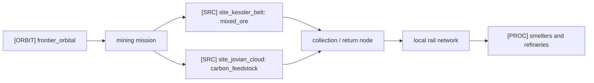

# Resource Relationship Atlas

This is the text-first atlas for understanding how ores, refined elements, manufactured parts, nodes, power, Railgates, and remote extraction sites relate to each other. It is intentionally a Markdown document instead of an HTML page so it stays inside the repository's CLI/stdio-first product surface.

## Placeholder Glyph Key

| Glyph | Meaning | Current backend object |
| --- | --- | --- |
| `[SRC]` | raw source, deposit, or remote site | `ResourceDeposit`, `SpaceSite` |
| `[EXT]` | extractor or collection node | `NetworkNode(kind=extractor)` |
| `[PROC]` | smelter, refiner, or processor | `ResourceRecipe(kind=smelting/refining)` |
| `[ASM]` | assembler, semiconductor line, or fabricator | `ResourceRecipe(kind=electronics_assembly/semiconductor/fabrication)` |
| `[PWR]` | power plant or power support | `PowerPlant`, `GatePowerSupport` |
| `[RGATE]` | Railgate anchor, receiving terminal, or derivative aperture corridor | `NetworkNode(kind=gate_hub)`, `NetworkLink(mode=gate)` |
| `[ORBIT]` | spaceport, orbital yard, or collection station | `NetworkNode(kind=spaceport)` |
| `[EXO]` | undiscovered exotic resource | `ResourceDefinition(discovered_by_default=false)` |

## Current Playable Chain

```mermaid
flowchart LR
    iron_ore["[SRC] iron_rich_ore"] --> ore_pit["[EXT] frontier_ore_pit"]
    carbon["[SRC] carbon_feedstock"] --> carbon_rig["[EXT] frontier_carbon_rig"]
    silica["[SRC] silica_sand"] --> silica_quarry["[EXT] frontier_silica_quarry"]
    copper_ore["[SRC] copper_sulfide_ore"] --> copper_pit["[EXT] frontier_copper_pit"]

    ore_pit --> smelter["[PROC] iron_smelting"]
    carbon_rig --> smelter
    smelter --> iron["iron"]

    silica_quarry --> silicon_refiner["[PROC] silicon_refining"]
    carbon_rig --> silicon_refiner
    silicon_refiner --> silicon["silicon"]

    copper_pit --> copper_refinery["[PROC] copper_refining"]
    copper_refinery --> copper["copper"]

    copper --> electronics_line["[ASM] electronics_assembly"]
    silicon --> electronics_line
    electronics_line --> electronics["electronics"]

    electronics --> semiconductor_line["[ASM] semiconductor_lithography"]
    silicon --> semiconductor_line
    semiconductor_line --> semiconductors["semiconductors"]

    iron --> gate_fabricator["[ASM] aperture_control_fabrication"]
    semiconductors --> gate_fabricator
    gate_fabricator --> gate_components["aperture control components"]

    carbon_rig --> thermal["[PWR] frontier_low_basin_thermal"]
    thermal --> generated_power["generated world power"]
    gate_components --> support["[PWR] frontier_gate_component_support"]
    generated_power --> gate["[RGATE] gate_frontier_outer"]
    support --> gate
```

## Resource Layer Map

| Layer | Examples in catalog | Main gameplay job |
| --- | --- | --- |
| Raw sources | `mixed_ore`, `iron_rich_ore`, `copper_sulfide_ore`, `bauxite`, `silica_sand`, `carbon_feedstock`, `water_ice`, `fissile_ore`, `rare_earth_concentrate` | Give worlds and remote sites strategic value. |
| Refined elements | `iron`, `copper`, `aluminum`, `silicon`, `carbon`, `hydrogen`, `oxygen`, `nitrogen`, `lithium`, `cobalt`, `uranium`, `thorium`, `helium_3` | Convert messy deposits into recipe-ready inputs. |
| Industrial materials | `fuel`, `coolant`, `steel`, `ceramics` | Feed plants, processors, construction, and later reactor loops. |
| Manufactured goods | `parts`, `electronics`, `semiconductors` | Build automation, controls, and higher-tier factory outputs. |
| Advanced systems | `reactor_parts`, `gate_components` | Unlock durable power, Railgate stability, and expansion systems. |
| Exotic discoveries | `gate_reactive_isotope`, `null_lattice_crystal` | Support late-game research, Railgate overcharging, and remote anomalies. |

## Implemented Recipe Cards

| Recipe id | Glyph | Inputs | Outputs | Typical node |
| --- | --- | --- | --- | --- |
| `iron_smelting` | `[PROC]` | `6 iron_rich_ore`, `1 carbon_feedstock` | `4 iron` | `frontier_smelter` |
| `silicon_refining` | `[PROC]` | `3 silica_sand`, `1 carbon_feedstock` | `3 silicon` | `frontier_silicon_refiner` |
| `copper_refining` | `[PROC]` | `4 copper_sulfide_ore` | `2 copper` | `frontier_copper_refinery` |
| `electronics_assembly` | `[ASM]` | `1 copper`, `2 silicon` | `2 electronics` | `frontier_electronics_assembler` |
| `semiconductor_lithography` | `[ASM]` | `1 electronics`, `1 silicon` | `1 semiconductors` | `frontier_semiconductor_line` |
| `aperture_control_fabrication` | `[ASM]` | `4 iron`, `1 semiconductors` | `1 gate_components` | `frontier_gate_fabricator` |
| `frontier_low_basin_thermal` | `[PWR]` | `1 carbon_feedstock` | `40 generated power` | `frontier_thermal_plant` |

## Node Relationship Cards

| Node type | What it owns | What it should show in 2D |
| --- | --- | --- |
| Extractor | Deposit id, resource output, storage, transfer limit | Deposit glyph, yield, grade, storage pressure, rail outlet direction. |
| Industry | Resource recipe, input inventory, output inventory | Input ports, blocked inputs, output port, active recipe, local rail links. |
| Depot / warehouse | Cargo and resource inventory | Stockpile bars, transfer pressure, connected rail branches. |
| Railgate anchor / receiving terminal | Railgate links, power status, handoff slots | Powered/unpowered state, corridor capacity, support inputs, destination world. |
| Spaceport | Remote sites and mining missions | Launch buttons, mission status, returned resource target, fuel/power blockers. |
| Power plant | Plant inputs, generated power, blockers | Fuel input, output MW, blocked state, connected gate burden. |

## Power And Railgate Relationships

| Relationship | Current rule |
| --- | --- |
| Static world power | `WorldState.power_available - power_used` gives the base margin before gates. |
| Generated power | Active `PowerPlant` inputs add `power_generated_this_tick` for that world. |
| Railgate reservation | Railgate links reserve effective power from their source world when evaluated. |
| Railgate support | `GatePowerSupport` checks required advanced resources and reduces effective Railgate draw while support is available. |
| Blocked state | Missing plant fuel or missing Railgate-support resources appear in reports and snapshots. |

## Remote Extraction Hooks

Future remote sites should add fuel or power costs, construction requirements for collection stations, risk, discovery state, and richer resource mixes. The local UI should treat these as the same relationship family as deposits: source, route, collection node, processing chain, blocker.

## Sprint 21C UI Targets

| Target | Why it matters |
| --- | --- |
| Grid-snapped local placement | Keeps build previews predictable and prevents drifting node layouts. |
| Resource relationship atlas | Gives designers and implementers a shared map of current and planned chains. |
| Node drill-in cards | Lets the 2D client show why a chain is blocked before any 3D scene exists. |
| Rail branch and signal overlays | Makes dense industry clusters legible as branching networks rather than simple A-to-B lines. |
| Power/Railgate overlay | Connects plant fuel, generated power, support inputs, and Railgate status in one inspection path. |

## Generation Plan

This page is hand-authored for Sprint 21C. A later CLI command can generate the same tables from:

- `resource_catalog_payload()`
- built-in scenario `ResourceRecipe` definitions
- `PowerPlant` and `GatePowerSupport` registries
- `SpaceSite` and mining mission snapshots
- per-node resource inventory, demand, blockers, and branch-pressure reports
